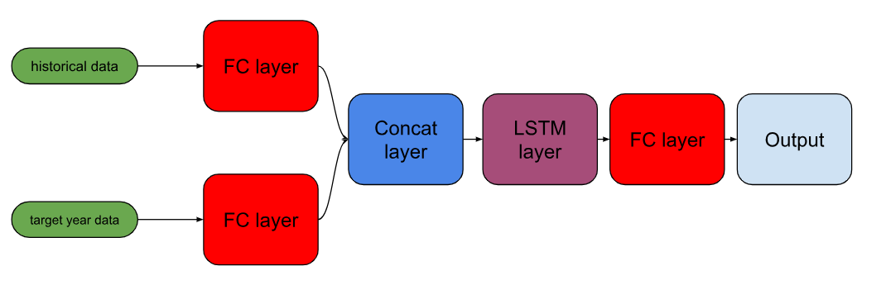
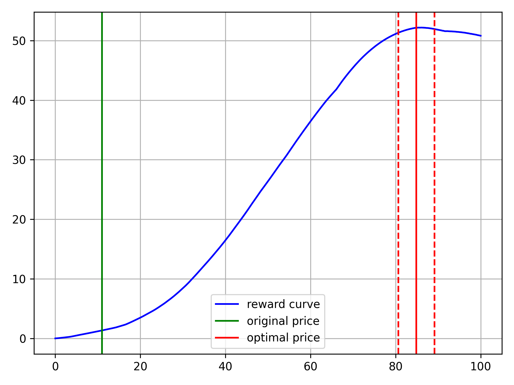
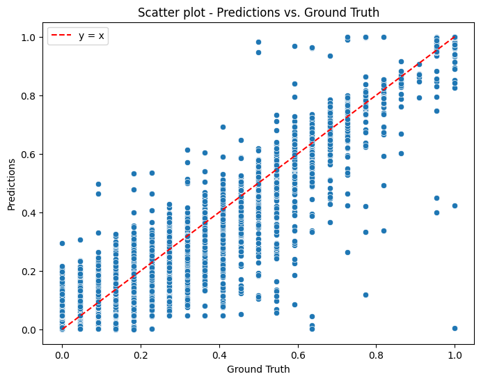
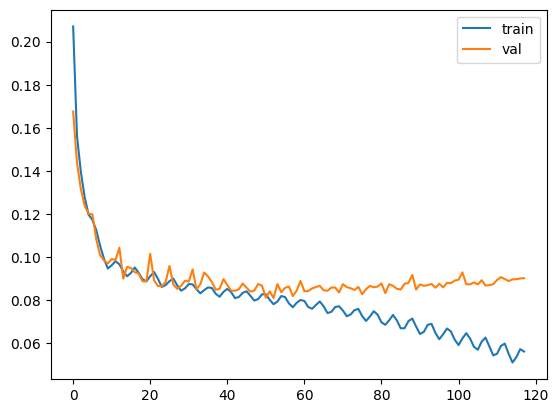

# Dynamic Pricing

## 1. Introduction

The goal of the project is optimize to price the of entity for target year using historical data.

The global steps are.

* ### 1. Train environment model using historical data for entities.
**Model architecture**

For minibatch size $B$, number of years in historical data $T$, number of neighboring entities $N$,
historical data features $F_{1}$ and target year features $F_{2}$.

We define historical data  $X \in R^{B \times T \times F_{1} \times N}$, target year data  $x \in R^{B \times F_{2}}$.

The first linear layer reduces the dimenstion of historical data $R^{B \times T \times F_{1} \times N} \rightarrow R^{B \times T \times F_{1}}$ which results in merging the entity and its neighboring entities features.

The second linear layer increases the feature size of target year data $R^{B \times F_{2}} \rightarrow R^{B \times F_{1}}$. After this step two features are concatenated and passed into LSTM layer. 

The resulting features of LSTM layer are feed into the third linear layer which outputs the target.

For penalizing the model L1 loss is used.

$$ L_{1} = \dfrac{1}{N} \sum_{j = 1}^{N} \left| \hat{y_{j}} - y_{j} \right| $$
* ### 2. Reward function

The next step is to use the pretrained environment model and reward function to find optimal price.

We define reward as

$$ \mathcal{R}(p) = p * \mathcal{N}\mathcal{N}(p)$$

The reward function is maximized using gradient ascent algorithm, taking the initial value as the original price.

$$ p_{0} = x_{price}^{target}$$
$$ p_{n+1} = p_{n} + \lambda \dfrac{\partial \mathcal{R}(p)}{\partial p_{n}}$$

Here is an example of reward function and optimal value.

## 2. Training and results

The model is trained using Adam optimizer. The minimum validation loss 0.09 is reached. 

Model performance during the training and the final result are shown below.
 

    
    

## 3. Inference

To run inference

`python inference.py --data-root-dir --out-root-dir --qid QID --price-min --price-max --price-num`
